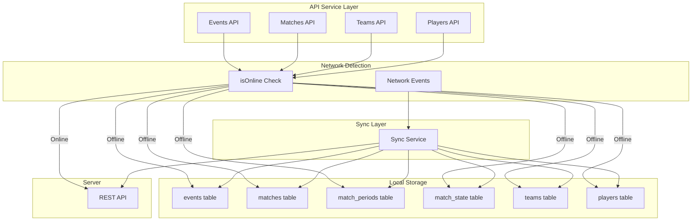

# Design Document: Authenticated Offline Mode

## Overview

This design implements local-first architecture for authenticated users, allowing them to continue working when offline or with poor connectivity. The approach mirrors the existing guest mode pattern: write to local IndexedDB tables with `synced: false`, then sync to server when online.

The key insight is that the infrastructure already exists from the offline-sync-refactor spec - we just need to add offline fallbacks to the API services.

## Architecture



### Data Flow

**Online Mode (Current Behavior):**
```
User Action → API Service → Server API → Response → UI Update
```

**Offline Mode (New Behavior):**
```
User Action → API Service → Network Check → Offline Detected
    → Write to Local Table (synced: false)
    → Return Local Data → UI Update
    
Later: Online Event → Sync Service → Server API → Update synced: true
```

## Components and Interfaces

### Network Detection Utility

**File:** `frontend/src/utils/network.ts`

```typescript
/**
 * Check if the device is currently online
 */
export function isOnline(): boolean {
  return typeof navigator !== 'undefined' && navigator.onLine;
}

/**
 * Check if a request should use offline fallback
 * Returns true if offline OR if the error is a network error
 */
export function shouldUseOfflineFallback(error?: Error): boolean {
  if (!isOnline()) return true;
  if (error?.message?.includes('Network') || 
      error?.message?.includes('fetch') ||
      error?.name === 'TypeError') {
    return true;
  }
  return false;
}
```

### API Service Pattern

Each API service will follow this pattern for write operations:

```typescript
async function createEntity(data: EntityData): Promise<Entity> {
  // Try server first if online
  if (isOnline()) {
    try {
      const response = await apiClient.post('/entities', data);
      return response.data;
    } catch (error) {
      // If network error, fall through to offline handling
      if (!shouldUseOfflineFallback(error)) {
        throw error; // Re-throw non-network errors (400, 401, etc.)
      }
    }
  }
  
  // Offline fallback: write to local table
  const localEntity = await writeToLocalTable(data);
  showOfflineToast('Saved locally - will sync when online');
  return localEntity;
}
```

### Events API Updates

**File:** `frontend/src/services/api/eventsApi.ts`

```typescript
async create(event: EventCreateRequest): Promise<Event> {
  // Try server first if online
  if (isOnline()) {
    try {
      const response = await apiClient.post<Event>('/events', event);
      return response.data;
    } catch (error) {
      if (!shouldUseOfflineFallback(error)) throw error;
    }
  }
  
  // Offline fallback
  const { db } = await import('../../db/indexedDB');
  const { getAuthUserId } = await import('../../utils/auth');
  
  const localEvent = {
    id: `event-${Date.now()}-${Math.random().toString(36).substr(2, 9)}`,
    match_id: event.matchId,
    kind: event.kind,
    period_number: event.periodNumber,
    clock_ms: event.clockMs,
    team_id: event.teamId,
    player_id: event.playerId,
    notes: event.notes,
    sentiment: event.sentiment || 0,
    ts_server: Date.now(),
    created_at: Date.now(),
    updated_at: Date.now(),
    created_by_user_id: getAuthUserId(), // Use authenticated user ID
    is_deleted: false,
    synced: false,
  };
  
  await db.events.add(localEvent);
  showOfflineToast('Event saved locally');
  
  return transformToApiEvent(localEvent);
}
```

### Matches API Updates

**File:** `frontend/src/services/api/matchesApi.ts`

Key methods needing offline fallback:
- `startMatch()` - Create match_state with status LIVE
- `pauseMatch()` - Update match_state to PAUSED
- `resumeMatch()` - Update match_state to LIVE
- `completeMatch()` - Update match_state to COMPLETED
- `startPeriod()` - Create match_periods record
- `endPeriod()` - Update match_periods with ended_at

### Teams API Updates

**File:** `frontend/src/services/api/teamsApi.ts`

```typescript
async createTeam(teamData: TeamCreateRequest): Promise<Team> {
  if (isOnline()) {
    try {
      const response = await apiClient.post<Team>('/teams', teamData);
      return response.data;
    } catch (error) {
      if (!shouldUseOfflineFallback(error)) throw error;
    }
  }
  
  // Offline fallback - similar to guest mode but with auth user ID
  const { db } = await import('../../db/indexedDB');
  const { getAuthUserId } = await import('../../utils/auth');
  
  const id = crypto.randomUUID();
  await db.teams.add({
    id,
    team_id: id,
    name: teamData.name,
    color_primary: teamData.homeKitPrimary,
    color_secondary: teamData.homeKitSecondary,
    created_at: Date.now(),
    updated_at: Date.now(),
    created_by_user_id: getAuthUserId(),
    is_deleted: false,
    synced: false,
  });
  
  return transformToApiTeam(await db.teams.get(id));
}
```

### Offline Status Indicator

**File:** `frontend/src/components/OfflineIndicator.tsx`

```typescript
export function OfflineIndicator() {
  const [isOffline, setIsOffline] = useState(!navigator.onLine);
  const [pendingSync, setPendingSync] = useState(0);
  
  useEffect(() => {
    const handleOnline = () => setIsOffline(false);
    const handleOffline = () => setIsOffline(true);
    
    window.addEventListener('online', handleOnline);
    window.addEventListener('offline', handleOffline);
    
    return () => {
      window.removeEventListener('online', handleOnline);
      window.removeEventListener('offline', handleOffline);
    };
  }, []);
  
  if (!isOffline && pendingSync === 0) return null;
  
  return (
    <div className="offline-indicator">
      {isOffline ? (
        <span>📴 Offline - changes saved locally</span>
      ) : (
        <span>🔄 Syncing {pendingSync} items...</span>
      )}
    </div>
  );
}
```

## Data Models

No new data models required. Uses existing tables with `synced` flag:
- `events` table
- `matches` table
- `match_periods` table
- `match_state` table
- `teams` table
- `players` table

## Correctness Properties

*A property is a characteristic or behavior that should hold true across all valid executions of a system-essentially, a formal statement about what the system should do. Properties serve as the bridge between human-readable specifications and machine-verifiable correctness guarantees.*

### Property 1: Offline Event Creation

*For any* event creation request while offline, the event should be stored in the local events table with `synced` equals false and `created_by_user_id` equals the authenticated user's ID.

**Validates: Requirements 1.1, 5.1**

### Property 2: Offline Data Persistence

*For any* data created while offline, the data should persist in local storage and be available for reading even after app restart.

**Validates: Requirements 1.2, 2.1, 3.1, 3.2**

### Property 3: Automatic Sync on Reconnect

*For any* unsynced record created by an authenticated user, when the device comes back online, the Sync Service should attempt to sync that record to the server.

**Validates: Requirements 1.3, 2.4, 3.3**

### Property 4: Network Error Fallback

*For any* API call that fails with a network error, the system should fall back to local storage instead of throwing an error to the user.

**Validates: Requirements 6.1, 6.2**

### Property 5: User Attribution Preservation

*For any* data created offline by an authenticated user, the `created_by_user_id` should be the authenticated user's ID (not a guest ID), and this should be preserved when synced to the server.

**Validates: Requirements 5.1, 5.2, 5.3**

## Error Handling

| Error Condition | Handling Strategy |
|----------------|-------------------|
| Network offline | Write to local table, show offline indicator |
| API timeout | Treat as offline, write locally |
| API 5xx error | Treat as offline, write locally, retry later |
| API 4xx error | Do NOT fall back to local (validation error) |
| Local storage full | Show error, suggest clearing old data |
| Sync conflict | Server wins for same record, preserve local unsynced |

## Testing Strategy

### Unit Tests
- Test each API service's offline fallback behavior
- Test network detection utility
- Test offline indicator component

### Property-Based Tests
- Property 1: Offline event creation
- Property 2: Offline data persistence
- Property 3: Automatic sync on reconnect
- Property 4: Network error fallback
- Property 5: User attribution preservation

### Integration Tests
- Full offline/online cycle test
- Intermittent connectivity test
- Multiple offline operations then sync test

