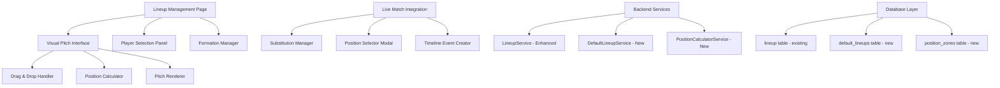

# Design Document

## Overview

The lineup management system provides coaches with comprehensive tools to create default team formations and manage real-time substitutions during matches. The system consists of three main components: a visual pitch interface for intuitive player positioning, a default lineup management system for consistent team setup, and seamless integration with the existing live match functionality for real-time substitution tracking.

The design leverages the existing database schema and API patterns while introducing new frontend components for visual lineup management. The system maintains statistical accuracy through precise timing data and supports flexible formations without rigid position constraints.

## Architecture

### System Components



### Data Flow

1. **Default Lineup Creation**: Coach selects team → Visual pitch loads → Players positioned via drag/drop → Formation saved to default_lineups table
2. **Match Preparation**: Match selected → Default lineup loaded → Modifications made → Match-specific lineup created
3. **Live Substitutions**: Live match active → Player substitution triggered → Position selector shown → Lineup table updated → Timeline event created

## Components and Interfaces

### Frontend Components

#### 1. LineupManagementPage
**Location**: `frontend/src/pages/LineupManagementPage.tsx`

```typescript
interface LineupManagementPageProps {
  onNavigate?: (page: string) => void;
}

interface LineupManagementState {
  selectedTeam: Team | null;
  players: PlayerWithPosition[];
  currentFormation: FormationData;
  isDefaultMode: boolean;
  isDirty: boolean;
}
```

**Responsibilities**:
- Team selection and player loading
- Mode switching (default vs match-specific)
- Save/load formation data
- Integration with existing navigation patterns

#### 2. VisualPitchInterface
**Location**: `frontend/src/components/lineup/VisualPitchInterface.tsx`

```typescript
interface VisualPitchInterfaceProps {
  players: PlayerWithPosition[];
  formation: FormationData;
  onPlayerMove: (playerId: string, position: PitchPosition) => void;
  onPlayerRemove: (playerId: string) => void;
  readonly?: boolean;
}

interface PitchPosition {
  x: number; // 0-100 percentage
  y: number; // 0-100 percentage
  zone: PositionZone;
}

interface PositionZone {
  code: string; // GK, CB, LB, etc.
  area: BoundingBox;
  priority: number; // For overlapping zones
}
```

**Responsibilities**:
- Render football pitch with proper proportions
- Handle drag and drop for player positioning
- Real-time position calculation and feedback
- Touch and mouse event handling
- Visual feedback for position zones

#### 3. PlayerSelectionPanel
**Location**: `frontend/src/components/lineup/PlayerSelectionPanel.tsx`

```typescript
interface PlayerSelectionPanelProps {
  players: PlayerWithPosition[];
  groupedByPosition: Record<string, PlayerWithPosition[]>;
  onPlayerDragStart: (player: PlayerWithPosition) => void;
  selectedPlayers: Set<string>;
  maxPlayers: number;
}
```

**Responsibilities**:
- Display available players grouped by preferred position
- Initiate drag operations
- Show player selection status
- Filter and search functionality

#### 4. PositionSelectorModal
**Location**: `frontend/src/components/lineup/PositionSelectorModal.tsx`

```typescript
interface PositionSelectorModalProps {
  isOpen: boolean;
  onClose: () => void;
  onPositionSelect: (position: string) => void;
  availablePositions: string[];
  playerName: string;
}
```

**Responsibilities**:
- Show position selection during substitutions
- Filter positions based on pitch areas
- Provide quick selection interface

### Backend Services

#### 1. Enhanced LineupService
**Location**: `backend/src/services/LineupService.ts` (existing, enhanced)

**New Methods**:
```typescript
async getCurrentLineup(matchId: string, currentTime: number): Promise<LineupWithDetails[]>
async makeSubstitution(matchId: string, playerOffId: string, playerOnId: string, position: string, currentTime: number): Promise<SubstitutionResult>
async getActivePlayersAtTime(matchId: string, timeMinutes: number): Promise<PlayerWithPosition[]>
```

#### 2. DefaultLineupService (New)
**Location**: `backend/src/services/DefaultLineupService.ts`

```typescript
interface DefaultLineupData {
  teamId: string;
  formation: FormationPlayer[];
  createdAt: Date;
  updatedAt: Date;
}

interface FormationPlayer {
  playerId: string;
  position: string;
  pitchX: number;
  pitchY: number;
}

class DefaultLineupService {
  async saveDefaultLineup(teamId: string, formation: FormationPlayer[], userId: string): Promise<DefaultLineupData>
  async getDefaultLineup(teamId: string, userId: string): Promise<DefaultLineupData | null>
  async applyDefaultToMatch(teamId: string, matchId: string, userId: string): Promise<Lineup[]}
}
```

#### 3. PositionCalculatorService (New)
**Location**: `backend/src/services/PositionCalculatorService.ts`

```typescript
class PositionCalculatorService {
  async calculatePosition(pitchX: number, pitchY: number): Promise<string>
  async getPositionZones(): Promise<PositionZone[]>
  async validateFormation(players: FormationPlayer[]): Promise<ValidationResult>
}
```

## Data Models

### New Database Tables

#### 1. default_lineups
```sql
CREATE TABLE grassroots.default_lineups (
  id UUID PRIMARY KEY DEFAULT gen_random_uuid(),
  team_id UUID NOT NULL REFERENCES grassroots.teams(id) ON DELETE CASCADE,
  formation_data JSONB NOT NULL,
  created_at TIMESTAMPTZ DEFAULT NOW(),
  updated_at TIMESTAMPTZ,
  created_by_user_id UUID NOT NULL REFERENCES grassroots.users(id),
  deleted_at TIMESTAMPTZ,
  deleted_by_user_id UUID REFERENCES grassroots.users(id),
  is_deleted BOOLEAN DEFAULT FALSE,
  UNIQUE(team_id, created_by_user_id)
);
```

#### 2. position_zones
```sql
CREATE TABLE grassroots.position_zones (
  id UUID PRIMARY KEY DEFAULT gen_random_uuid(),
  position_code grassroots.position_code NOT NULL,
  zone_name VARCHAR(50) NOT NULL,
  min_x DECIMAL(5,2) NOT NULL, -- 0-100 percentage
  max_x DECIMAL(5,2) NOT NULL,
  min_y DECIMAL(5,2) NOT NULL,
  max_y DECIMAL(5,2) NOT NULL,
  priority INTEGER DEFAULT 1,
  created_at TIMESTAMPTZ DEFAULT NOW()
);
```

### Enhanced Existing Models

#### lineup table enhancements
- Add `pitch_x` and `pitch_y` columns for visual positioning
- Add `substitution_reason` column for tracking substitution context

```sql
ALTER TABLE grassroots.lineup 
ADD COLUMN pitch_x DECIMAL(5,2),
ADD COLUMN pitch_y DECIMAL(5,2),
ADD COLUMN substitution_reason VARCHAR(100);
```

## Error Handling

### Frontend Error Scenarios

1. **Drag and Drop Failures**
   - Network connectivity issues during save
   - Invalid player positioning
   - Concurrent modification conflicts

2. **Position Calculation Errors**
   - Invalid pitch coordinates
   - Overlapping player positions
   - Formation validation failures

3. **Live Match Integration Errors**
   - Match state synchronization issues
   - Substitution timing conflicts
   - Player eligibility validation

### Backend Error Handling

1. **Data Validation**
   - Formation completeness validation
   - Player availability checking
   - Position constraint validation

2. **Concurrency Control**
   - Optimistic locking for lineup updates
   - Match state consistency checks
   - Timeline event ordering

3. **Authorization Errors**
   - Team access validation
   - Match permission checking
   - Player roster verification

### Error Recovery Strategies

1. **Auto-save and Recovery**
   - Periodic formation state saving
   - Browser storage backup
   - Conflict resolution UI

2. **Graceful Degradation**
   - Fallback to list-based interface
   - Simplified position selection
   - Manual position entry

## Testing Strategy

### Unit Tests

#### Frontend Components
- **VisualPitchInterface**: Drag/drop behavior, position calculations, touch events
- **PlayerSelectionPanel**: Player filtering, drag initiation, selection state
- **PositionSelectorModal**: Position filtering, selection handling

#### Backend Services
- **DefaultLineupService**: CRUD operations, formation validation, data integrity
- **PositionCalculatorService**: Zone calculations, position mapping, validation logic
- **Enhanced LineupService**: Substitution logic, timing calculations, state management

### Integration Tests

#### API Endpoints
- Default lineup management endpoints
- Enhanced lineup endpoints with positioning data
- Live match substitution workflows

#### Database Operations
- Formation data persistence and retrieval
- Position zone queries and calculations
- Lineup history and timeline integration

### End-to-End Tests

#### User Workflows
1. **Default Lineup Creation**
   - Team selection → Player positioning → Formation saving → Verification

2. **Match Preparation**
   - Default lineup loading → Modifications → Match-specific saving

3. **Live Substitutions**
   - Match state → Player selection → Position choice → Timeline update

#### Cross-Platform Testing
- Touch interactions on mobile devices
- Mouse interactions on desktop
- Responsive layout validation
- Performance under different network conditions

### Performance Testing

#### Frontend Performance
- Drag and drop responsiveness with 11+ players
- Pitch rendering performance on various devices
- Memory usage during extended sessions

#### Backend Performance
- Formation calculation speed
- Concurrent lineup modification handling
- Database query optimization for complex lineup queries

### Accessibility Testing

#### Visual Accessibility
- High contrast mode support
- Screen reader compatibility for pitch interface
- Keyboard navigation for drag and drop alternatives

#### Motor Accessibility
- Alternative input methods for positioning
- Simplified interaction modes
- Customizable touch targets

## Implementation Phases

### Phase 1: Core Infrastructure
- Database schema updates
- Basic DefaultLineupService implementation
- PositionCalculatorService with static zones
- Enhanced LineupService methods

### Phase 2: Visual Interface
- VisualPitchInterface component
- Basic drag and drop functionality
- PlayerSelectionPanel implementation
- Position zone visualization

### Phase 3: Default Lineup Management
- LineupManagementPage implementation
- Formation save/load functionality
- Team selection and player management
- Basic validation and error handling

### Phase 4: Live Match Integration
- PositionSelectorModal implementation
- Substitution workflow integration
- Timeline event creation
- Match state synchronization

### Phase 5: Polish and Optimization
- Advanced validation and error handling
- Performance optimization
- Accessibility improvements
- Comprehensive testing coverage