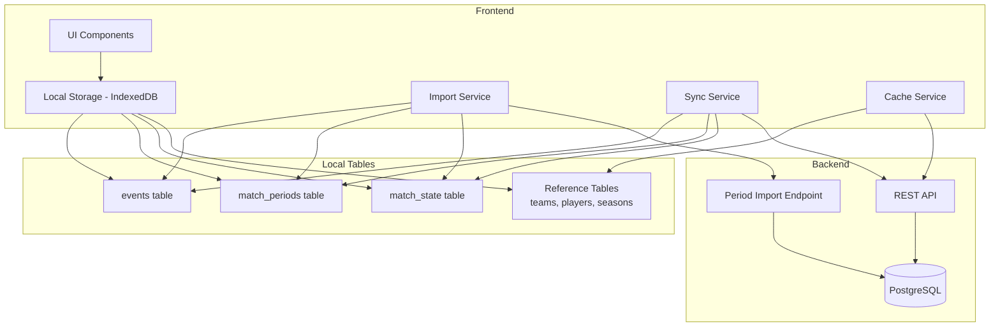

# Design Document: Offline Sync Refactor (Milestones 4-8)

## Overview

This design document covers the remaining implementation of the offline sync architecture refactor. The system transitions from an outbox-based approach to a local-tables-with-synced-flag approach, enabling:

- Direct table writes with sync status tracking
- Preserved timestamps during guest data import
- Automatic background sync for authenticated users
- Intelligent caching with different retention policies for reference vs temporal data
- Seamless migration from the legacy outbox system

The architecture follows a "local-first" principle where local tables are the source of truth for offline operation, with the `synced` flag indicating server synchronization status.

## Architecture



### Data Flow

**Guest Mode Import Flow:**
```
User logs in → Check for guest data (created_by_user_id starts with 'guest-')
    → Read ALL guest data from LOCAL TABLES
    → Push to server with ID mapping (periods use import endpoint)
    → Clear local guest data
    → Reload with fresh server data
```

**Authenticated Sync Flow:**
```
User creates/updates data → Write to local table (synced: false)
    → UI updates immediately
    → Background sync worker processes unsynced items
    → POST to API endpoints
    → Mark synced: true, synced_at: timestamp
```

**Cache Refresh Flow:**
```
App loads (online) → Sync unsynced local data first
    → Refresh reference data (teams, players, seasons)
    → Cleanup old temporal data (>30 days, synced only)
    → Cache recent matches
```

## Components and Interfaces

### Import Service Updates

**File:** `frontend/src/services/importService.ts`

```typescript
interface ImportResult {
  success: boolean;
  importedCounts: {
    seasons: number;
    teams: number;
    players: number;
    matches: number;
    events: number;
    matchPeriods: number;  // from match_periods table
    matchStates: number;   // from match_state table
    lineups: number;
  };
  errors: ImportError[];
}

interface ImportError {
  table: string;
  recordId: string;
  error: string;
}

// Updated function signatures
export async function hasGuestData(): Promise<boolean>;
export async function runImport(): Promise<ImportResult>;
```

**Key Changes:**
- `hasGuestData()` checks all local tables for guest records
- `runImport()` reads from local tables instead of outbox
- Periods imported via dedicated endpoint with preserved timestamps
- Match state used to determine final match status (COMPLETED matches trigger server completion)
- Cleanup includes new tables (match_periods, match_state)

**Match State Import Logic:**
- For each match with a local match_state record:
  - If status is 'COMPLETED', call the match completion endpoint on the server
  - If status is 'LIVE' or 'PAUSED', the match remains in progress on the server
  - The match_state table tracks local state; server state is derived from periods and events

### Sync Service Updates

**File:** `frontend/src/services/syncService.ts`

```typescript
interface SyncResult {
  synced: number;
  failed: number;
  errors: SyncError[];
}

interface SyncError {
  table: string;
  recordId: string;
  error: string;
}

// Updated function signatures
export async function flushOnce(): Promise<SyncResult>;
async function syncEvents(): Promise<SyncResult>;
async function syncMatchPeriods(): Promise<SyncResult>;
async function syncMatchState(): Promise<SyncResult>;
```

**Key Changes:**
- Processes unsynced records from tables (not outbox)
- Excludes guest data (created_by_user_id starts with 'guest-')
- Updates synced flag and synced_at timestamp on success
- Batches operations (50 records per batch)

### Cache Service (New)

**File:** `frontend/src/services/cacheService.ts`

```typescript
const THIRTY_DAYS_MS = 30 * 24 * 60 * 60 * 1000;

interface CacheStats {
  referenceDataRefreshed: boolean;
  temporalDataCleaned: number;
  matchesCached: number;
}

export async function refreshCache(): Promise<CacheStats>;
export async function refreshReferenceData(): Promise<void>;
export async function cleanupOldTemporalData(): Promise<number>;
export async function cacheRecentMatches(): Promise<number>;
```

**Retention Policies:**
- Reference data (teams, players, seasons): Indefinite retention
- Temporal data (matches, events, periods, state, lineups): 30-day retention for synced records
- Unsynced data: Never deleted regardless of age

### Backend Period Import Endpoint

**File:** `backend/src/routes/matches.ts`

```typescript
// POST /api/matches/:id/periods/import
interface PeriodImportRequest {
  periodNumber: number;
  periodType: 'REGULAR' | 'EXTRA_TIME' | 'PENALTY_SHOOTOUT';
  startedAt: string;  // ISO timestamp - preserved
  endedAt?: string;   // ISO timestamp - preserved
  durationSeconds?: number;
}

interface PeriodImportResponse {
  id: string;
  matchId: string;
  periodNumber: number;
  periodType: string;
  startedAt: string;
  endedAt: string | null;
  durationSeconds: number | null;
}
```

### Migration Script

**File:** `frontend/src/db/indexedDB.ts` (version upgrade handler)

```typescript
// Migration functions
async function migrateOutboxEvents(tx: Transaction): Promise<number>;
async function migrateMatchCommands(tx: Transaction): Promise<number>;
async function migrateLiveStateSettings(tx: Transaction): Promise<number>;
```

## Data Models

### Existing Tables (Updated)

All syncable tables now include:
```typescript
interface SyncableRecord {
  synced: boolean;      // false = needs sync, true = synced
  synced_at?: number;   // timestamp of last successful sync
}
```

### New Tables (Already Created in Milestone 1-3)

```typescript
interface LocalMatchPeriod {
  id: string;
  match_id: string;
  period_number: number;
  period_type: 'REGULAR' | 'EXTRA_TIME' | 'PENALTY_SHOOTOUT';
  started_at: number;   // timestamp - PRESERVED
  ended_at?: number;    // timestamp - PRESERVED
  duration_seconds?: number;
  created_by_user_id: string;
  synced: boolean;
  synced_at?: number;
}

interface LocalMatchState {
  match_id: string;     // Primary key
  status: 'NOT_STARTED' | 'LIVE' | 'PAUSED' | 'COMPLETED';
  current_period_id?: string;
  timer_ms: number;
  last_updated_at: number;
  created_by_user_id: string;
  synced: boolean;
  synced_at?: number;
}
```

## Correctness Properties

*A property is a characteristic or behavior that should hold true across all valid executions of a system-essentially, a formal statement about what the system should do. Properties serve as the bridge between human-readable specifications and machine-verifiable correctness guarantees.*

### Property 1: Guest Data Detection

*For any* set of records across all syncable tables, the `hasGuestData()` function should return true if and only if at least one record has a `created_by_user_id` that starts with 'guest-'.

**Validates: Requirements 1.1**

### Property 2: Timestamp Preservation Round-Trip

*For any* match period with valid `started_at`, `ended_at`, and `duration_seconds` values, importing the period via the import endpoint and then retrieving it should return a period with identical timestamp values.

**Validates: Requirements 1.3, 7.1, 7.2, 7.3**

### Property 3: Import Cleanup Completeness

*For any* successful import operation, all records in all local tables where `created_by_user_id` starts with 'guest-' should be deleted after the import completes.

**Validates: Requirements 1.5**

### Property 4: Sync Processing Coverage

*For any* record in a syncable table (events, match_periods, match_state) where `synced` equals false and `created_by_user_id` does not start with 'guest-', the sync service should attempt to sync that record to the server.

**Validates: Requirements 2.1, 2.2, 2.3**

### Property 5: Sync Flag Update Correctness

*For any* record that is successfully synced to the server, the record should have `synced` set to true and `synced_at` set to a timestamp within a reasonable tolerance of the sync completion time.

**Validates: Requirements 2.4**

### Property 6: Guest Data Sync Exclusion

*For any* sync operation, no records where `created_by_user_id` starts with 'guest-' should be sent to the server.

**Validates: Requirements 2.6**

### Property 7: Temporal Data Cleanup Age Threshold

*For any* temporal data record (matches, events, periods, state, lineups) where `synced` equals true and the record is older than 30 days, the cleanup operation should delete that record.

**Validates: Requirements 3.1**

### Property 8: Unsynced Data Preservation

*For any* record where `synced` equals false, the cleanup operation should preserve that record regardless of its age.

**Validates: Requirements 3.2**

### Property 9: Reference Data Retention

*For any* reference data record (teams, players, seasons), the cleanup operation should preserve that record regardless of age or sync status.

**Validates: Requirements 3.3**

### Property 10: Migration Event Preservation

*For any* event record in the outbox table, after migration, an equivalent record should exist in the events table with the same data and preserved sync status.

**Validates: Requirements 4.1**

### Property 11: Migration Timestamp Reconstruction

*For any* sequence of match commands in the outbox (start_period, end_period), the migration should create match_periods records where `started_at` and `ended_at` match the original command creation timestamps.

**Validates: Requirements 4.2**

### Property 12: Migration State Reconstruction

*For any* match with commands in the outbox, after migration, the match_state record should reflect the final state implied by the command sequence (e.g., if last command was 'complete', status should be 'COMPLETED').

**Validates: Requirements 4.3**

### Property 13: Offline Reference Data Access

*For any* request for reference data (teams, players, seasons) while the device is offline, the system should return cached data without throwing network errors.

**Validates: Requirements 6.1, 6.2**

### Property 14: Refresh Preserves Unsynced Records

*For any* reference data refresh operation, records where `synced` equals false should be preserved while synced records may be replaced with server data.

**Validates: Requirements 6.3, 6.4**

### Property 15: Import Authorization Validation

*For any* period import request, the backend should reject the request with a 403 status if the authenticated user does not own the match.

**Validates: Requirements 7.5**

## Error Handling

### Import Service Errors

| Error Condition | Handling Strategy |
|----------------|-------------------|
| Network failure during import | Preserve local data, report error, allow retry |
| Server validation error | Log specific record, continue with remaining records |
| Partial import failure | Report which records failed, preserve failed records locally |
| ID mapping conflict | Generate new server ID, update local references |

### Sync Service Errors

| Error Condition | Handling Strategy |
|----------------|-------------------|
| Network offline | Skip sync cycle, retry when online |
| Authentication expired | Trigger re-authentication flow |
| Server 4xx error | Log error, mark record for manual review |
| Server 5xx error | Retry with exponential backoff |

### Cache Service Errors

| Error Condition | Handling Strategy |
|----------------|-------------------|
| Network failure during refresh | Use existing cache, log warning |
| Partial refresh failure | Keep existing data for failed tables |
| Storage quota exceeded | Trigger aggressive cleanup of old synced data |

### Migration Errors

| Error Condition | Handling Strategy |
|----------------|-------------------|
| Corrupted outbox record | Log error, skip record, continue migration |
| Missing required fields | Use sensible defaults where possible |
| Duplicate key conflict | Skip duplicate, log warning |

## Testing Strategy

### Dual Testing Approach

This implementation uses both unit tests and property-based tests:

- **Unit tests**: Verify specific examples, edge cases, and error conditions
- **Property-based tests**: Verify universal properties that should hold across all inputs

### Property-Based Testing Framework

**Framework:** fast-check (already used in the project)

**Configuration:** Each property test should run a minimum of 100 iterations.

### Test Categories

#### Import Service Tests

1. **Unit Tests:**
   - `hasGuestData()` returns false for empty tables
   - `hasGuestData()` returns true when guest events exist
   - `runImport()` handles empty guest data gracefully
   - `runImport()` reports errors for failed records

2. **Property Tests:**
   - Property 1: Guest data detection
   - Property 2: Timestamp preservation round-trip
   - Property 3: Import cleanup completeness

#### Sync Service Tests

1. **Unit Tests:**
   - `flushOnce()` skips when offline
   - `flushOnce()` skips when not authenticated
   - Sync handles network errors gracefully

2. **Property Tests:**
   - Property 4: Sync processing coverage
   - Property 5: Sync flag update correctness
   - Property 6: Guest data sync exclusion

#### Cache Service Tests

1. **Unit Tests:**
   - `cleanupOldTemporalData()` handles empty tables
   - `refreshReferenceData()` handles network errors
   - Cache refresh triggers after coming online

2. **Property Tests:**
   - Property 7: Temporal data cleanup age threshold
   - Property 8: Unsynced data preservation
   - Property 9: Reference data retention
   - Property 13: Offline reference data access
   - Property 14: Refresh preserves unsynced records

#### Migration Tests

1. **Unit Tests:**
   - Migration handles empty outbox
   - Migration logs summary on completion
   - Migration continues after encountering errors

2. **Property Tests:**
   - Property 10: Migration event preservation
   - Property 11: Migration timestamp reconstruction
   - Property 12: Migration state reconstruction

#### Backend Tests

1. **Unit Tests:**
   - Period import endpoint validates required fields
   - Period import endpoint returns 400 for invalid timestamps
   - Period import endpoint returns 403 for unauthorized access

2. **Property Tests:**
   - Property 2: Timestamp preservation (backend portion)
   - Property 15: Import authorization validation

### Test Annotation Format

Each property-based test must be annotated with:
```typescript
// **Feature: offline-sync-refactor, Property {number}: {property_text}**
// **Validates: Requirements X.Y**
```
