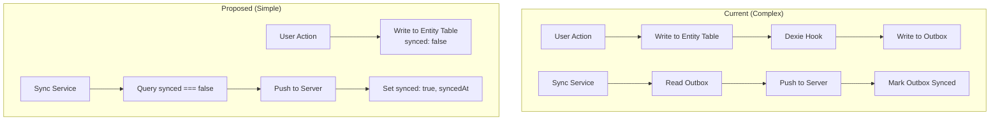

# Design Document: Remove Outbox and Simplify Sync

## Overview

This design removes the redundant outbox table from the IndexedDB schema and consolidates sync tracking onto the entity tables themselves. Each entity table already has `synced: boolean` and `syncedAt?: IsoDateTimeString` fields via the `SyncableRecord` interface. The outbox pattern is unnecessary when using soft-delete and per-record sync flags.

The simplified architecture:
1. All writes go directly to entity tables with `synced: false`
2. Sync service queries each table for `synced === false` records
3. On successful server push, mark `synced: true` and set `syncedAt`
4. No separate operation log (outbox) needed

## Architecture



## Components and Interfaces

### Removed Components

1. **DbOutboxEvent type** - No longer needed
2. **EnhancedOutboxEvent type alias** - No longer needed
3. **addToOutbox function** - Remove from `db/utils.ts`
4. **Outbox Dexie hooks** - Remove from `indexedDB.ts`
5. **Outbox table schema** - Remove from `SCHEMA_INDEXES`
6. **OutboxEventPayload interface** - Remove from `realTimeService.ts`

### Modified Components

#### RealTimeService

```typescript
// Before: Write to outbox on failure
private async addToOutbox(event: MatchEvent): Promise<void> {
  // Complex conversion and outbox write
}

// After: Write directly to events table
private async storeEventLocally(event: MatchEvent): Promise<void> {
  await db.events.add({
    ...event,
    synced: false,
    tsServer: new Date().toISOString()
  });
}
```

#### Sync Service

```typescript
interface SyncService {
  // Query unsynced records from entity tables
  getUnsyncedEvents(): Promise<DbEvent[]>;
  getUnsyncedMatches(): Promise<DbMatch[]>;
  
  // Mark records as synced
  markEventSynced(id: string): Promise<void>;
  markMatchSynced(id: string): Promise<void>;
}
```

#### GrassrootsDB

Remove outbox-related methods:
- `addEvent` (legacy outbox method)
- `getUnsyncedEvents` (outbox-based)
- `markEventSynced` (outbox-based)
- `markEventSyncFailed` (outbox-based)

Add/update entity-based sync methods:
- `getUnsyncedRecords<T>(tableName)` - Generic query for synced === false
- `markRecordSynced(tableName, id)` - Set synced: true, syncedAt

## Data Models

### Entity Tables (Unchanged)

All entity tables already extend `SyncableRecord`:

```typescript
interface SyncableRecord {
  synced: boolean;
  syncedAt?: IsoDateTimeString;
}
```

### Removed: DbOutboxEvent

```typescript
// REMOVE THIS TYPE
interface DbOutboxEvent {
  id?: number;
  tableName: string;
  recordId: string;
  operation: 'INSERT' | 'UPDATE' | 'DELETE';
  data?: unknown;
  payload?: unknown;
  synced: number;
  createdAt: number;
  retryCount: number;
  lastSyncAttempt?: number;
  syncError?: string;
  failedAt?: number;
  createdByUserId: string;
}
```

## Correctness Properties

*A property is a characteristic or behavior that should hold true across all valid executions of a system-essentially, a formal statement about what the system should do. Properties serve as the bridge between human-readable specifications and machine-verifiable correctness guarantees.*

### Property 1: Local writes set synced to false

*For any* entity record (event, match, team, player, etc.) created or updated locally, the `synced` field SHALL be `false` immediately after the operation.

**Validates: Requirements 1.1, 1.2, 3.1, 4.1**

### Property 2: Soft delete sets both flags

*For any* entity record that is soft-deleted locally, both `isDeleted` SHALL be `true` AND `synced` SHALL be `false` after the operation.

**Validates: Requirements 1.3**

### Property 3: No outbox writes occur

*For any* entity operation (create, update, delete), the outbox table SHALL remain empty (or not exist).

**Validates: Requirements 1.4, 2.1**

### Property 4: Successful sync updates flags

*For any* unsynced record that is successfully transmitted to the server, `synced` SHALL be `true` AND `syncedAt` SHALL be a valid ISO string after the sync operation.

**Validates: Requirements 3.3, 4.3**

### Property 5: Failed sync preserves unsynced state

*For any* unsynced record where server transmission fails, `synced` SHALL remain `false` after the failed sync attempt.

**Validates: Requirements 3.4**

### Property 6: Sync query finds all unsynced records

*For any* set of records where some have `synced === false`, the sync query SHALL return exactly those records with `synced === false`.

**Validates: Requirements 3.2, 4.2**

### Property 7: Date fields use ISO string format

*For any* entity record, all date/time fields including `syncedAt`, `createdAt`, and `updatedAt` SHALL be valid ISO 8601 strings.

**Validates: Requirements 5.1, 5.3**

## Error Handling

1. **Database write failure**: Log error, do not throw - allow UI to continue
2. **Sync transmission failure**: Keep `synced: false`, log error, retry on next sync cycle
3. **Schema migration**: Handle gracefully if outbox table exists from previous version (drop it)

## Testing Strategy

### Property-Based Testing

Use `fast-check` for property-based tests:

1. **Sync flag property**: Generate random entity records, perform operations, verify `synced === false`
2. **Soft delete property**: Generate random records, delete them, verify both flags
3. **Sync query property**: Generate mix of synced/unsynced records, verify query returns correct subset
4. **ISO format property**: Generate records with dates, verify all date fields match ISO pattern

### Unit Tests

1. **RealTimeService**: Test fallback to local storage when WebSocket fails
2. **Sync service**: Test query and mark-synced operations
3. **Schema**: Verify outbox table does not exist

### Integration Tests

1. **Offline event flow**: Create event offline, restore connectivity, verify sync
2. **Offline match flow**: Create match offline, restore connectivity, verify sync
